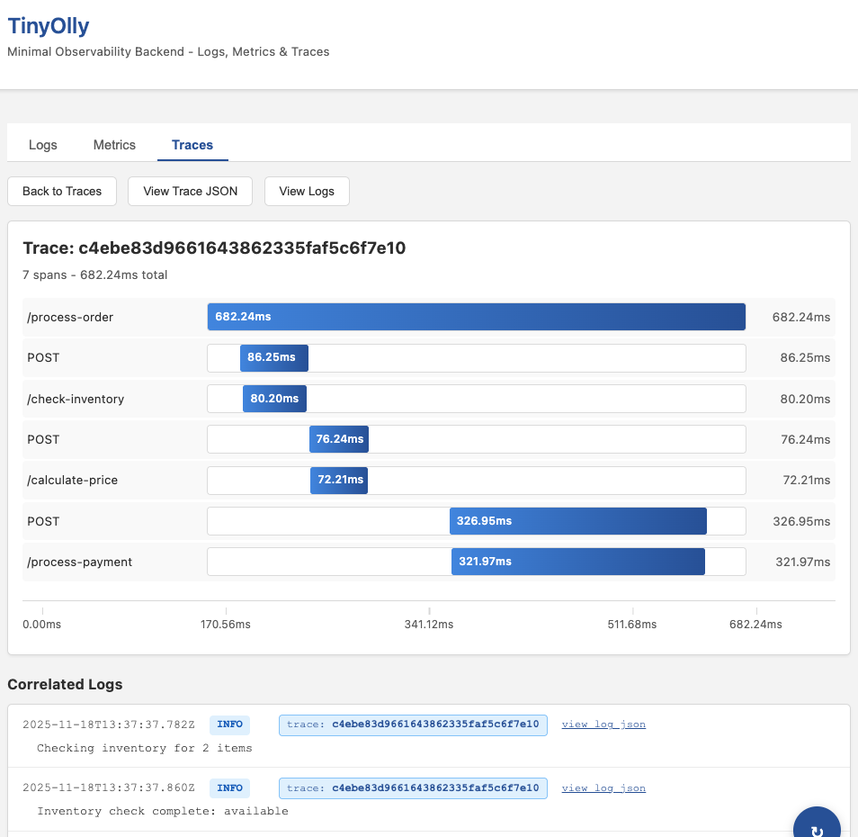
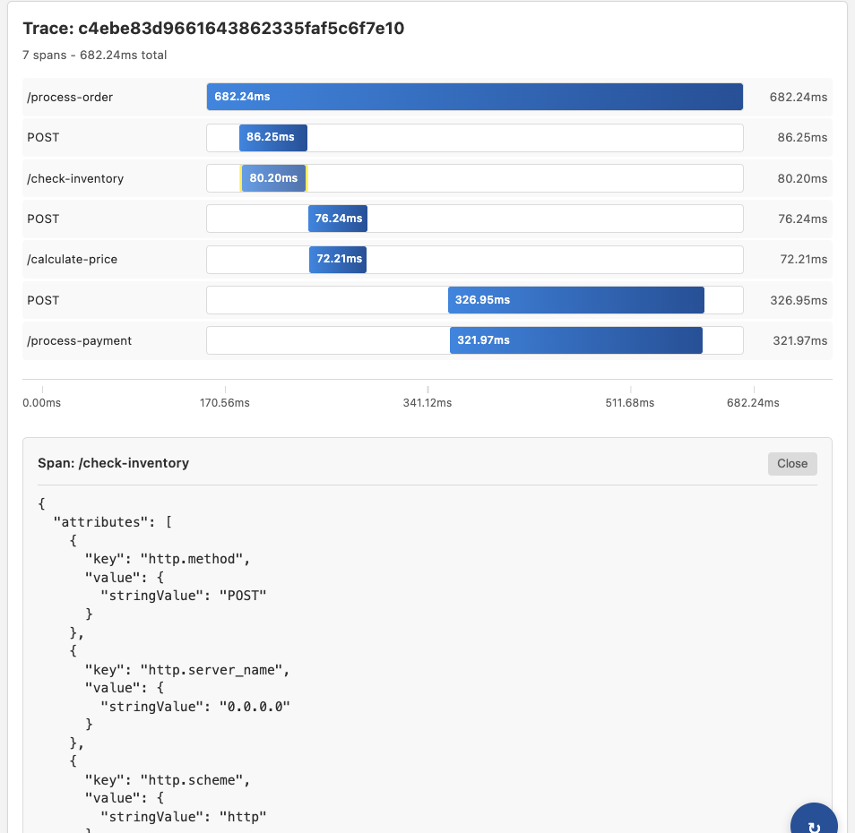
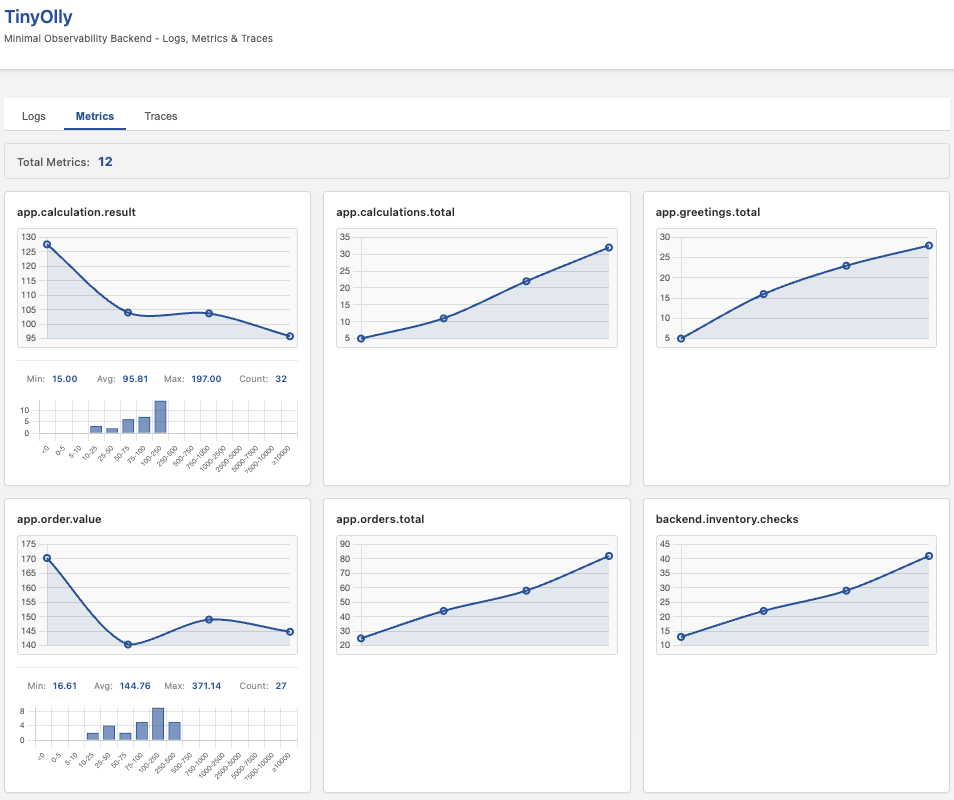
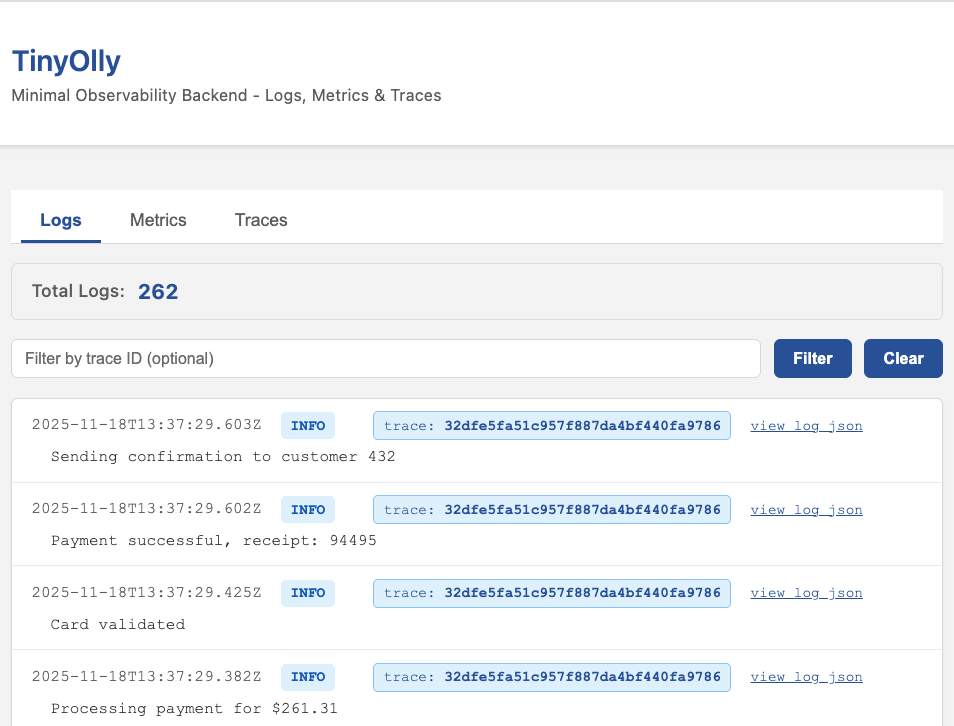

# TinyOlly - Learn Observability by Building It

A **minimal observability backend built from scratch** (~2,350 lines) to understand how logs, metrics, and traces work internally. No 3rd party Observability tools are used - just Flask, Redis, and Chart.js.

Includes two Flask microservices auto instrumenated for tracing and using OpenTelemetry Python SDK to export logs and metrics to an OpenTelemetry collector. This is the most modern design for taking advantage of OpenTelemetry using easy auto-instrumentation for traces yet writing properly formatted logs and metrics using the Otel SDK.

## Quick Start

> **Note:** Built and tested on Docker Desktop for Mac.

**1. Start the full stack:**
```bash
./01-start-tinyolly.sh
```

**2. Generate traffic** (keep running in a separate terminal):
```bash
./02-continuous-traffic.sh
```

**3. Open the UI:**
```bash
open http://localhost:5002
```

**4. Explore the traces:**
- Click the **Traces** tab
- Select a trace (look for `/process-order` - these show distributed tracing across services!)
- Click any span bar to view full JSON details
- Use the time axis to understand timing

**5. Stop everything:**
```bash
./03-stop-tinyolly.sh
```

## What You'll See

### Interactive Trace Waterfall
- Time axis showing when each operation occurred (0%, 25%, 50%, 75%, 100%)
- Click any span to inspect attributes, timing, and metadata
- Visual highlighting and smooth scrolling to details
- Distributed traces across frontend and backend microservices





### Real-Time Metrics
- Live charts with Chart.js animations (2-second refresh)
- Histogram metrics with min/max/avg/count and bucket distributions
- Counters and gauges with rolling 30-point window



### Correlated Logs
- Click trace ID in log → jump to trace detail
- Click "View Logs" in trace → filter logs by trace ID
- Bidirectional navigation between logs and traces
- Manual refresh to avoid distractions



## Bring Your Own App

Want to use TinyOlly with your own application? You can start just the observability backend without the demo apps.

**1. Start Core Services:**
```bash
./00-start-tinyolly-core.sh
```
This starts:
- **OTel Collector**: Listening on `localhost:4317` (gRPC) and `localhost:4318` (HTTP)
- **TinyOlly UI**: `http://localhost:5002`
- **Redis & Receiver**: Backend storage

**2. Instrument Your App:**
Point your OpenTelemetry exporter to `localhost:4317` (gRPC) or `localhost:4318` (HTTP).

**3. View Your Telemetry:**
Open `http://localhost:5002` to see your app's traces and metrics!

## Advanced: Console Viewing

Want to see raw telemetry in the terminal? Use console mode:

```bash
# Start collector with console output
./0A-start-console.sh

# Generate traffic (separate terminal)
./02-continuous-traffic.sh

# View telemetry in console
./0C-show-logs.sh     # Structured logs
./0D-show-traces.sh   # Distributed traces  
./0E-show-metrics.sh  # Metrics (refreshes every 2s)

# Cleanup
./0F-cleanup.sh
```

This mode uses the OpenTelemetry Collector's debug exporter to print telemetry to stdout.

## Architecture

```
Demo Frontend  ←→  Demo Backend (distributed tracing)
        ↓                    ↓
   OTel Collector  ←─────────┘
        ↓
   TinyOlly OTLP Receiver (parses OTLP, stores in Redis)
        ↓
   Redis (10-minute TTL)
        ↓
   TinyOlly UI (Flask + single HTML file)
```

**Key Points:**
- Apps use **automatic OpenTelemetry instrumentation** - no manual span creation
- HTTP calls between services automatically create distributed traces
- Apps only speak OTLP - they don't know TinyOlly exists
- Standard observability pipeline architecture
- **Add any container that emits OpenTelemetry and TinyOlly will display its telemetry**

**Demo Endpoints:**
- `/process-order` - Complex multi-service flow (inventory, pricing, payment)
- `/hello`, `/calculate`, `/error` - Simple endpoints
- All endpoints generate logs, metrics, and traces

## What You'll Learn

By reading ~2,350 lines of code, you'll understand:
- How to receive and parse OTLP telemetry
- How trace/span correlation works with logs
- How to build interactive waterfall visualizations
- How to display real-time metrics with histograms
- How in-memory storage with TTL works

**Code Breakdown:**
- Demo Frontend: ~270 lines (instrumented Flask app)
- Demo Backend: ~240 lines (distributed tracing demo)
- OTLP receiver: ~240 lines (protocol parsing, storage)
- TinyOlly backend: ~330 lines (API endpoints)
- UI: ~1,270 lines (HTML/JS with Chart.js)

No heavy frameworks - just Flask, Redis, Chart.js, and clear, commented code.